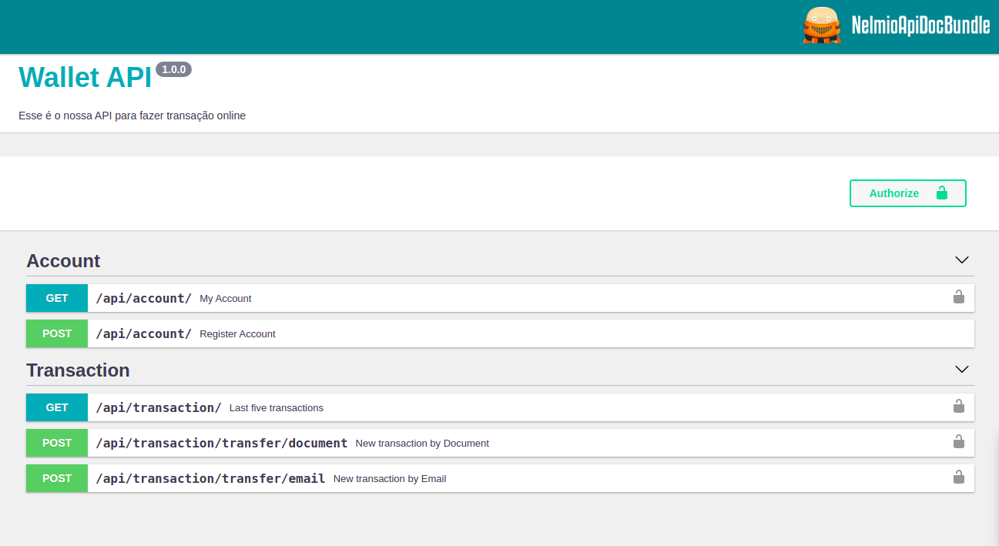
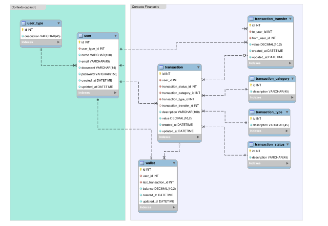

[](https://github.com/everaldofilho/wallet-api/actions/workflows/tests.yml)
[](https://coveralls.io/github/everaldofilho/wallet-api)

# Wallet API

A ideia desse projeto é poder fazer transferências entre usuários do próprio sistema.

## Setup

Para subir o projeto execute o seguinte comando

````
make setup
````

API URL: http://localhost:8089/api/doc



Database Postgres: 
- host: `localhost`
- port: `5433`
- user: `postgres`
- password: `root`

Arquivos/documentos na pasta [docs](./docs)
- [MER.svg](./docs/mer.svg)
- [WalletApi.postman_collection.json](./docs/WalletApi.postman_collection.json)

## Estutura do banco



## Tecnologias utilizadas

Container: #Docker

Linguagem: #PHP 7.4

Framework: #Symfony

Servidor: #Nginx

Banco de dados: #Postgree

Geração do Token: #JWT

Documentação API: #NelmioApiDoc